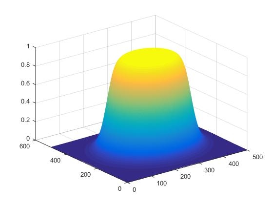
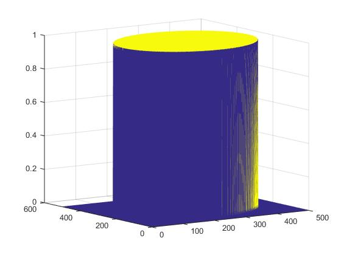
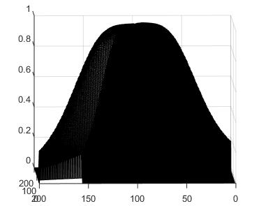

# Filters Frequency Domain Image Processing

Developing from Scratch Filters that change Images and apply them via Convolution With the purpose of Understand the Basics of Image Processing  - Originally developed 04/03/2018

## In this project it was developed 
1. A first and really important goal of the project was to create a function that can take as input an image, filter, and has as output a filtered image. This function will be used later in multiple steps through the project
2. The second step was to create multiple different Filters in the frequency domain and apply them on images
3. Finally, directional filters were developed in order to identify the differences and the pros and cons of each filter 

## Results of the Project 

## What I learned from this Project
- It was vital to deeply understand what is Fourier and how to use it 
- You needed a really good handle on both forward and backward Fourier and how to combine them on an actual piece of software 
- How to filter images from scratch 

## What was the project difficulties 
- Mainly understanding how to use Fourier transform 
- How to make the code robust for all images

## My solutions
- Instead of trying to understand the theory or create the code with small knowledge of the theory I tried to combine the two. I worked on the code and at the same time I was going back and reading, again and again, the theory it was a combination of the two that helped a lot at the end of the project 

